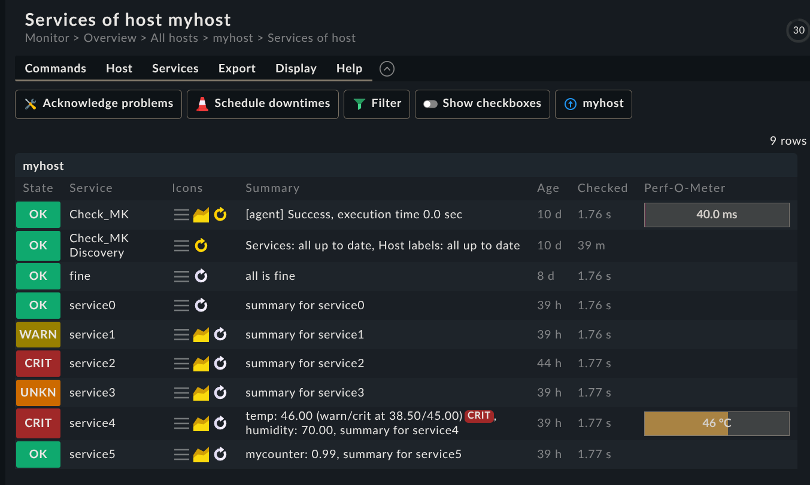
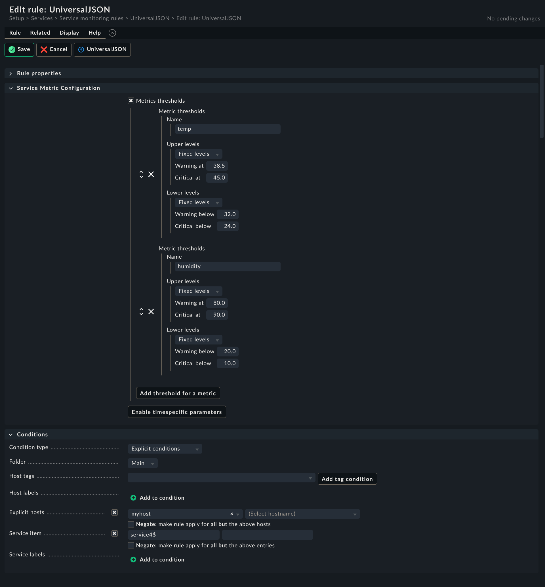
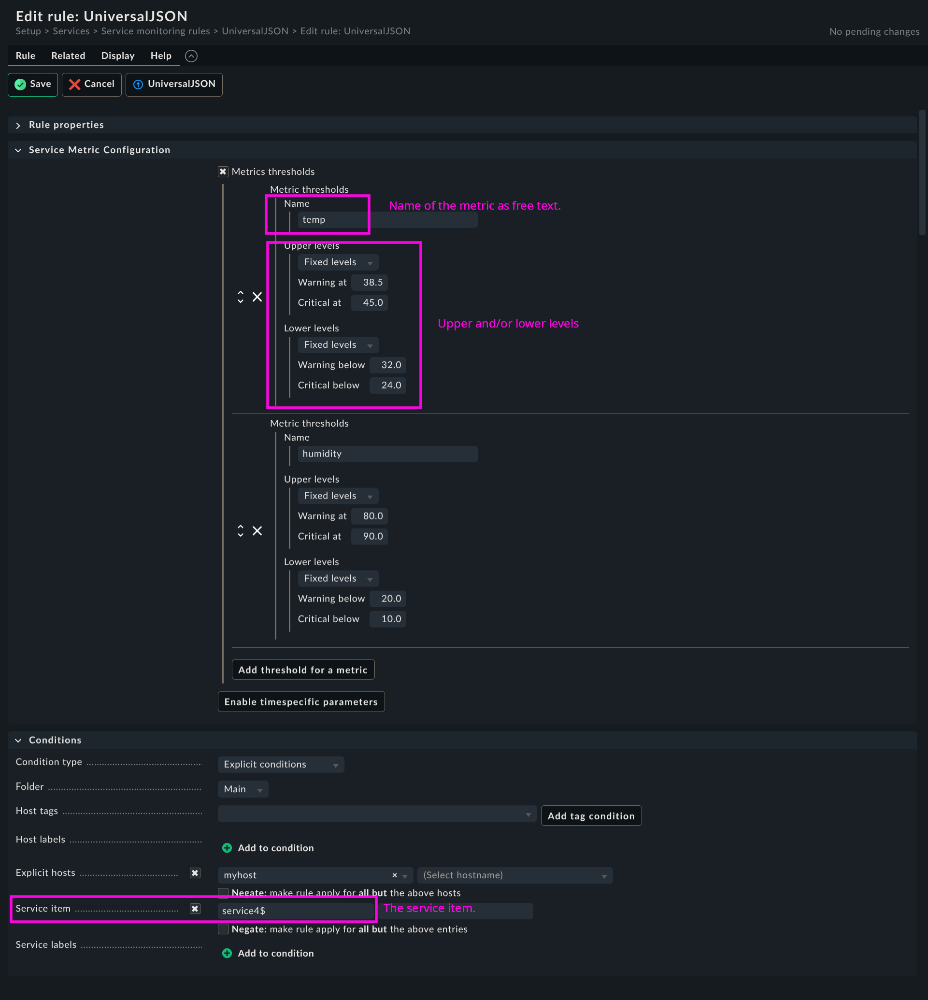

= UniversalJSON

* This is a check plugin for checkmk with a ruleset.
* It aims to be a "better" ``<<<local>>>`` check.

== Advantages over local check

* Agent section data is structured JSON.
* The agent can decide if the state is OK, WARNING, CRITICAL, or UNKNOWN just like with local checks ...
* 🍾 But you can configure service rules to override the state based on if threshold value are exceeded.
* In other words: If you have metrics, you can configure thresholds on the checkmk server.
* Unlike local checks it supports counters 🍻 !!!
* You can emit your own details and summary.

== How does this work?

=== Example: One service with details summary in OK state

.simple example
----
<<<universaljson:sep(0)>>>
{"services":{"service0":{"summary":"summary for service0","details":"details for service0, expected to be OK","state":0}}}
----

HINT: As common with checkmk, the JSON is expected to be on one line.

.human readable
[source,json,linenums]
----
{
  "services": {
    "service0": {
      "summary": "summary for service0",
      "details": "details for service0, expected to be OK",
      "state": 0
    }
  }
}
----

HINT
====
Here it's just pretty printed to make it easier to understand the structure of the JSON.
You can format your JSON to a single line with:
----
jq -c < file.json
jq --compact-output < file.json
----
====

=== Example: more complex JSON

.more complex JSON example
----
<<<universaljson:sep(0)>>>
{"services":{"service0":{"summary":"summary for service0","details":"details for service0, expected to be OK","state":0},"service1":{"summary":"summary for service1","details":"details for service1, expected to be WARN","state":1},"service2":{"summary":"summary for service2","details":"details for service2, expected to be CRIT","state":2},"service3":{"summary":"summary for service3","details":"details for service3, expected to be UNK","state":3},"service4":{"state":0,"summary":"summary for service4","details":"details for service4","metrics":{"temp":46,"humidity":70}},"service5":{"summary":"summary for service5","details":"details for service5, it's a counter","metrics":{"mycounter":"1754224044c"}}}}
----

.human readable
[source,json,linenums]
----
{
  "services": {
    "service0": {
      "summary": "summary for service0",
      "details": "details for service0, expected to be OK",
      "state": 0 
    },
    "service1": {
      "summary": "summary for service1",
      "details": "details for service1, expected to be WARN",
      "state": 1 
    },
    "service2": {
      "summary": "summary for service2",
      "details": "details for service2, expected to be CRIT",
      "state": 2
    },
    "service3": {
      "summary": "summary for service3",
      "details": "details for service3, expected to be UNK",
      "state": 3 
    },
    "service4": {
      "state": 0, 
      "summary": "summary for service4",
      "details": "details for service4",
      "metrics": {
        "temp": 46.0,
        "humidity": 70.0 
      }
    },
    "service5": {
      "summary": "summary for service5",
      "details": "details for service5, it's a counter",
      "metrics": {
        "mycounter": "1754143835c"
      }
    }
  }
}
----

.Explanation
* service4 genereates two float metrics *temp* and *humidity*.
* service5 generates a metric which is actually a *counter* because it's a string (using "quotes") and has a suffix of *c*, like it was common in nagios compatible checks.

== Ruleset
 

Full page, annotated ....

== Demo agent output

* link:assets/universaljson.txt[universaljson.txt]
* e.g. put it in https://docs.checkmk.com/latest/en/spool_directory.html[spool directory]

== TODO

* introduce a timestamp field to the json data and allow to warn if json data is outdated
* smooth the metric measurements with "truncated mean" a.k.a. trimmed mean (from the recent 5 past measurments drop the higest and the lowest and average the remaining 3) to avoid false alerts.
* add type hints to python code
* An "universal http(s) agent data fetcher" is in the pipe and will play well together with this check 
